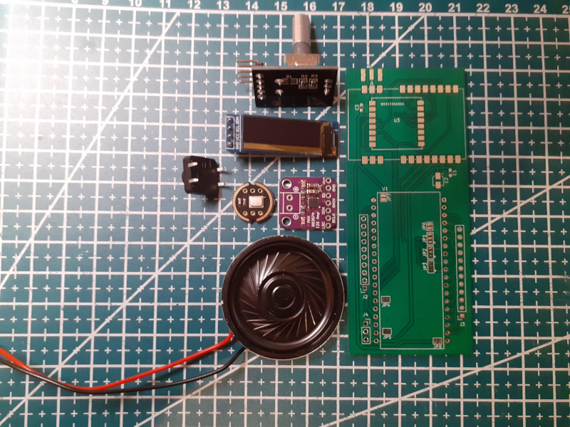
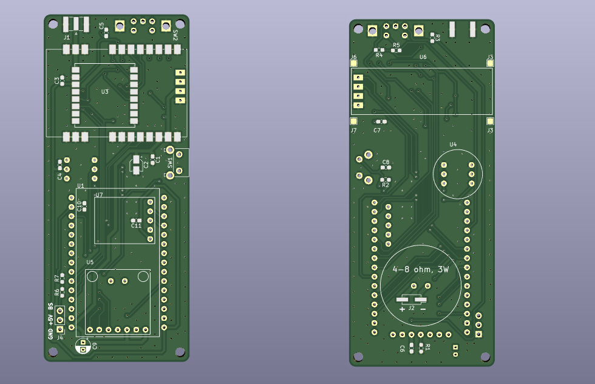
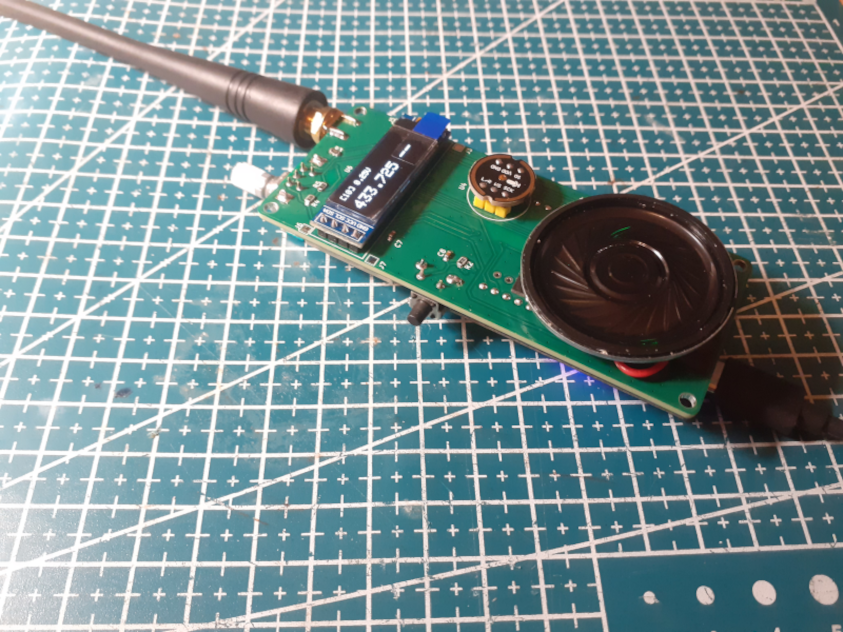

# ESP32 Codec2/OPUS DV Handheld Transceiver

## Introduction
⚠ **Please note that this device is experimental and lacks any form of certification. The author holds no responsibility for any fines incurred due to spectrum misuse, legal violations, or damages caused during its use. As with any experimental project, it is essential that you fully understand what you are doing and use it at your own risk.**

This project is a hobby/amateur/toy/educational radio ESP32 based LoRa/FSK Codec2/OPUS DV 3d printed handheld trasceiver a.k.a. walkie-talkie, which is using 1W/2W `E22-400M30S/E22-400M33S` (SX1268) radio module (UHF, 70cm band) or optionally 100mW `RA-01/RA-02` (SX1278) module. 

In theory, it could also be used with other modules from `E22-xxxMxxS` series with compatible pinouts, but targetting other bands, such as `E22-868M30S/E22-900M30S` (SX1262) modules (UHF, 868/915 MHz) or `E22-170M33S`/`E22-220M30S`, but not tested.

It functions like a standard FM walkie-talkie and, for simplicity and traffic optimization, does not utilize any communication protocol. Instead, it transmits audio codec frames (DV) using pre-configured digital radio modulation, such as LoRA or FSK. There are ideas to add voice over AX.25 and perhaps M17 protocol support in the future.

Overall components cost for this project is about 15-20$.

Schematics for the new board design, which includes integrated components, can be found in the `extras/schematics` directory. The pinouts remain compatible with the first prototype version. While there is a designated space for a GPS module, it should not be soldered as it is not currently supported; it is included solely for potential future experiments.

First prototype is based on https://github.com/sh123/esp32_loraprs modem, but uses additional peripherals:
- I2S speaker module MAX98357A + 4-8ohm 3w speaker (40mm diameter)
- I2S microphone INMP441
- PTT button (new board uses right angeled push button)
- Rotary encoder with push button (new board uses EC11 right angeled encoder)
- Small OLED display SSD1306 128x32
- Battery voltage monitoring (just voltage divider fed into ADC pin, see schematics)
- Powered from a single commonly avaialble 18650 cell (for example from old laptop battery)
- Uses combined charge + 5v boost controller based on Hotchip HT4928S (it is usually used in low capacity single cell USB power banks), but **better to use controllers such as IP6305_SK without auto shutdown on low current**.

Supports next features:
- Supports LoRa and FSK (no FEC) modulation with configurable modulation parameters from settings
- Supports Codec2 (low bit rate, 700-3200 bps) and OPUS (medium/high bit rate, 2400-512000 bps) audio codecs, codec could be selected from settings
- Goes into ESP32 light sleep when no activity, so all power consumption is around 30-40mA when in sleep RX (even lower with built-in esp32 leds scrapped), wakes up on new data from radio module or when user starts transmitting, consumes about 90-100mA in active receive and about 700-800mA in full power 1W transmit, so single 18650 cell should last for about 48 hours when in idle RX
- Settings menu on long encoder button click, allows to change frequency and other parameters
- Output power tunable from settings from ~1mW (for ISM toy usage) up to 2W (for amateur radio experiments)
- Experimental no warranty privacy option for ISM low power usage (⚠ **check your country regulations if it is allowed by the ISM band plan before experimenting as it might be illegal in some countries**), it is based on [ChaCha20-Poly1305](https://en.wikipedia.org/wiki/ChaCha20-Poly1305) stream cypher provided by [rwheater/Crypto](https://github.com/rweather/arduinolibs) library, it is comparable to AES256, uses 256 bits key, provides message authentication, but should have lower CPU requirements and power usage.

Planned features/ideas:
- Frequency split repeater mode, where two transceivers will be linked using espnow, so one will receive voice on RX frequency and then send packet using espnow to second transmitter which will receive packet using espnow and re-transmit it on TX frequency, this way receiver and transmitter could be positioned further apart with separate antennas thus eliminating need for duplexer
- Bluetooth headset pairing to use with hands free, so can use headset instead of i2s speaker/mic when needed
- Voice over AX.25, so meta data such as callsign could be included and visible on the other end
- M17 protocol support

## Build instructions
- Modify `include/config.h` if needed
- Install platformio
- Build with platformio
- Upload with platformio

## BOM
Bill of materials (BOM) for the new board constuction (credits to n0p and his club members for collecting it)
```
ESP-WROOM32 30pin - https://es.aliexpress.com/item/1005005953505528.html
Modem LoRa E22-400M30S (SX1268) - https://es.aliexpress.com/item/1005003122961059.html
I2S speaker module MAX98357A - https://es.aliexpress.com/item/1005005383121121.html
4ohm 3w speaker (40mm diameter) - https://es.aliexpress.com/item/1005006684947554.html
I2S microphone INMP441 - https://es.aliexpress.com/item/1005007889064664.html
Rotary encoder with push button - https://es.aliexpress.com/item/1005008091948369.html 
Small OLED display SSD1306 128×32 - https://es.aliexpress.com/item/1005008096924594.html
Uses combined charge + 5v boost controller - https://es.aliexpress.com/item/1005008657948784.html

18650 Cell
Botón switch tactile SKHH angled - https://es.aliexpress.com/item/1005005369415986.html
SMA-J-P-X-ST-EM1 Edgemount - https://es.aliexpress.com/item/10000000835065.html
R1 - 100k 0603 - https://es.aliexpress.com/item/1005005677654015.html
R2-R7 - 10k 0603 - https://es.aliexpress.com/item/1005005677654015.html
C1, C3-C8, C10, C11 - 100nF 0603 - https://es.aliexpress.com/item/32371454429.html
C2 - Elec 100uF SMD 3×5,3 - https://es.aliexpress.com/item/1005006724593986.html
C9 - 47uF Radial D4 mm P2 mm - https://es.aliexpress.com/item/1005005022177024.html

GPS - OPTIONAL - UNSUPPORTED ON WALKIE FW - CONFLICTS WITH ON BOARD SERIAL PORT PROGRAMMER - https://es.aliexpress.com/item/1005008733474270.html
```

## Pictures

Two fully 3d printed prototypes were built based on `esp32_loraprs` modem board.


List of peripherals used.



New board design with all components integrated into the board (except battery and charging circuit).



Case for the new board version with battery compartment.


Assembled board with new design.


